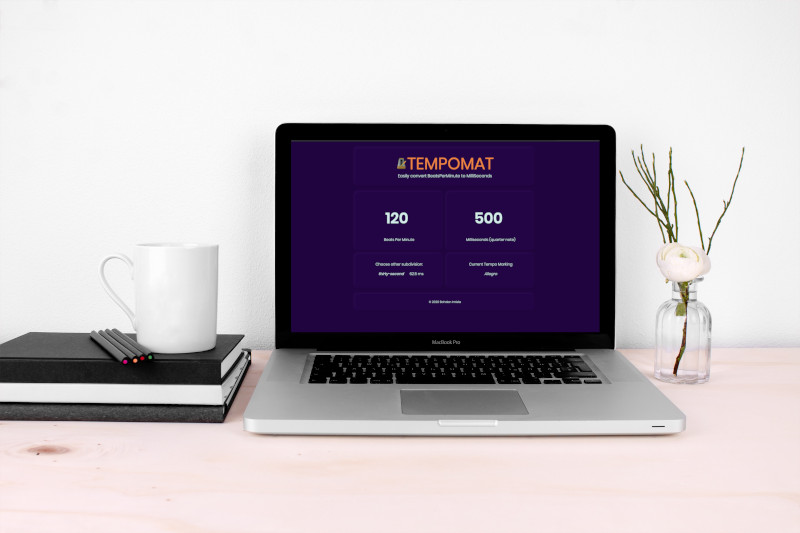

# Tempomat

- Convert bpm (beats per minute) to milliseconds.
- Choose subdivision (from thirty-two triplet note to whole note)
- Displays italian tempo marking name

[LIVE DEMO](https://bohdanone.github.io/tempomat)

-----------------------
My first App build with Svelte

-----------------------